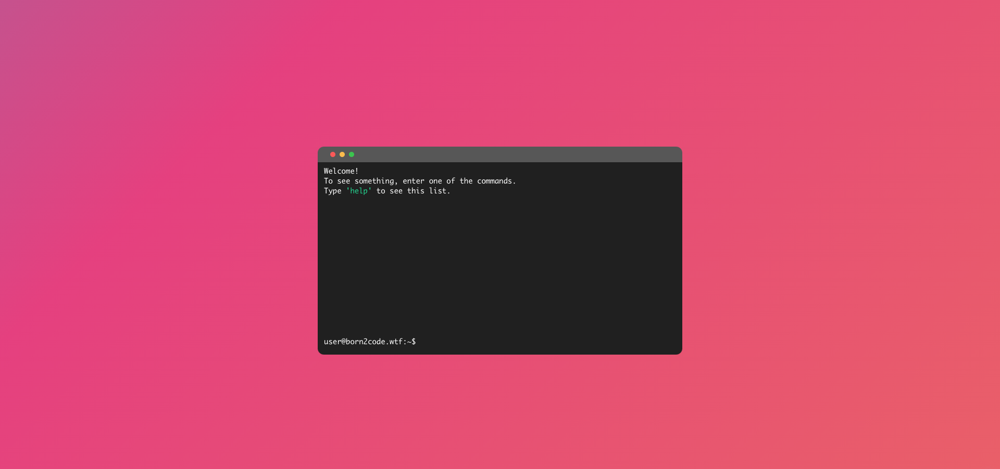
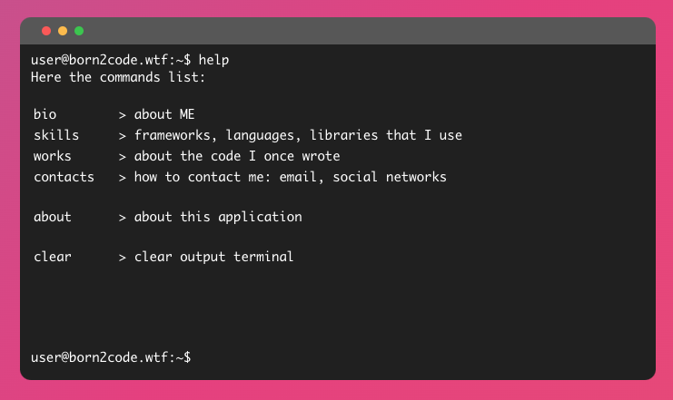

The idea is to implement a personal website as a web terminal.

The console supports several commands, each of which corresponds to a section of the site. Using a page is a set of console commands, the list of which can be seen if you send a 'help' command.

**Live site:** [https://born2code.wtf/](https://born2code.wtf/)
