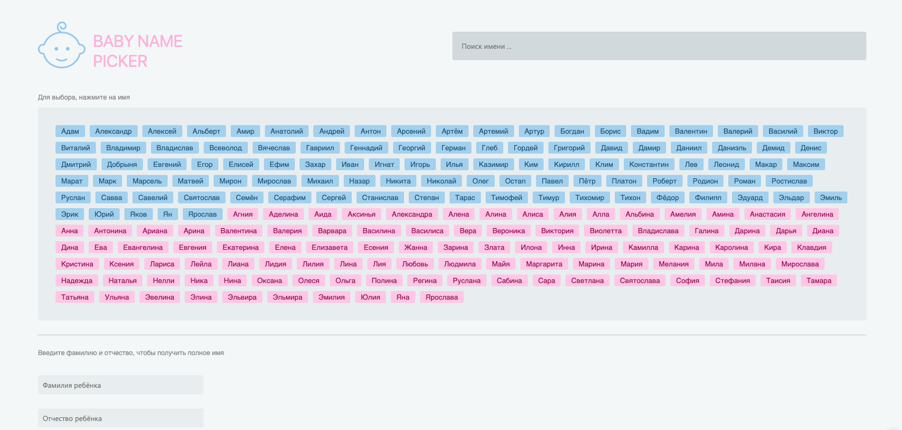
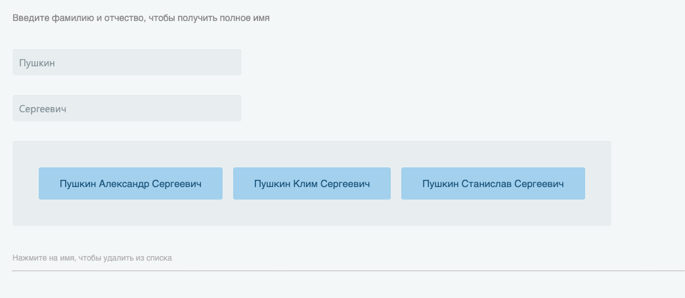

`JavaScript`, `React`, `Redux`, `HTML5`

This resource is designed so that you can calculate your strategic toilet paper supplies during the quarantine period. The top block of the page displays the current result. Use the sliders below to customize your settings. The result is approximate and depends on the characteristics of each paper manufacturer. Also, it does not take into account the individual parameters for each family member.

The site was created with SPA technology (single page application) using the React, Redux and Material-UI libraries. Currently tested on most devices used and is cross-platform application.

By the way, the project is multilingual and will support English, Russian and Ukrainian. The displayed language on the site depends on your browser settings.

**Live site:** [https://pickname.online/](https://pickname.online/)
