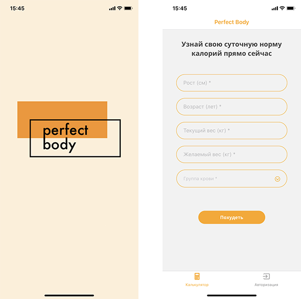
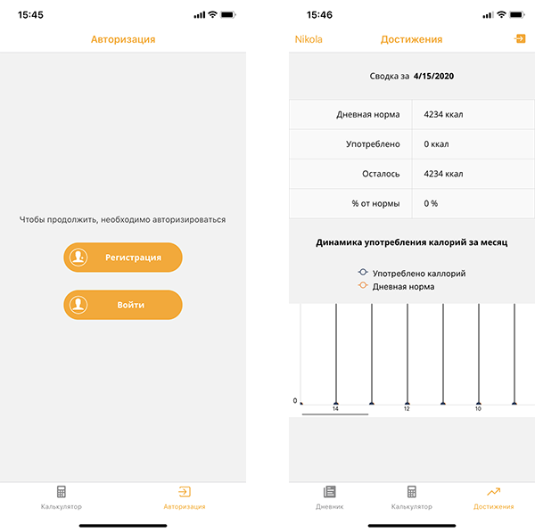
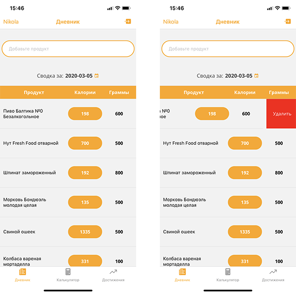

Mobile (iOS / Android) application to find and track your daily diet.

This app built on: 

* React
* React Native
* Redux
* JavaScript
* REST API
* MongoDB
* Expo

technologies.

Application features:
- calculate daily calorie intake
- keep a daily diet diary
- track the dynamics of the diet
- change diet settings
- synchronization with web client

**Application work on Expo platform**
