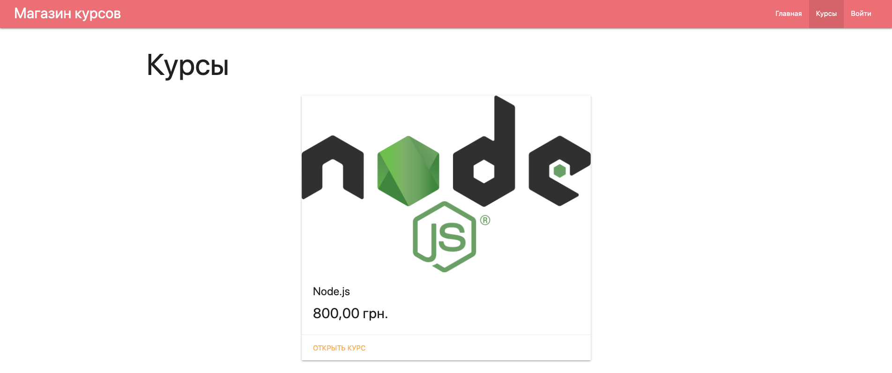
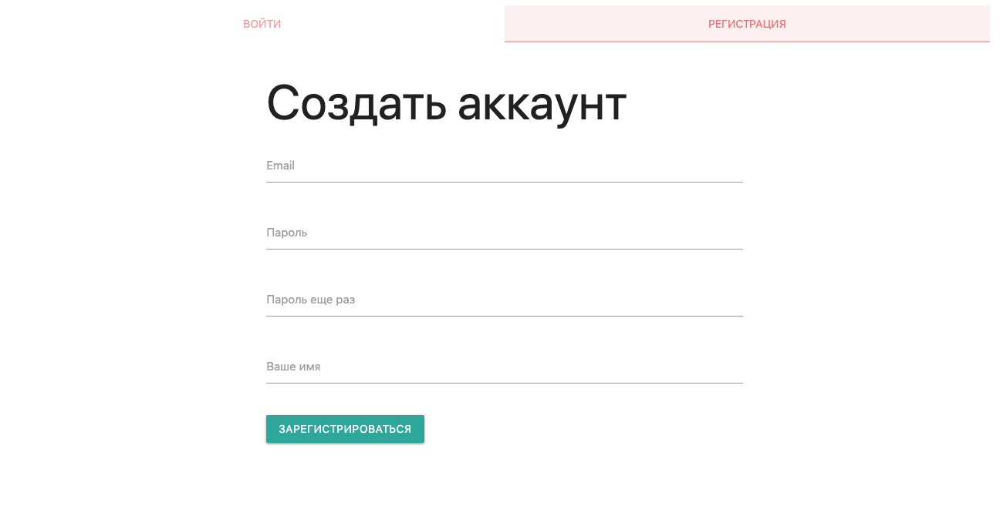
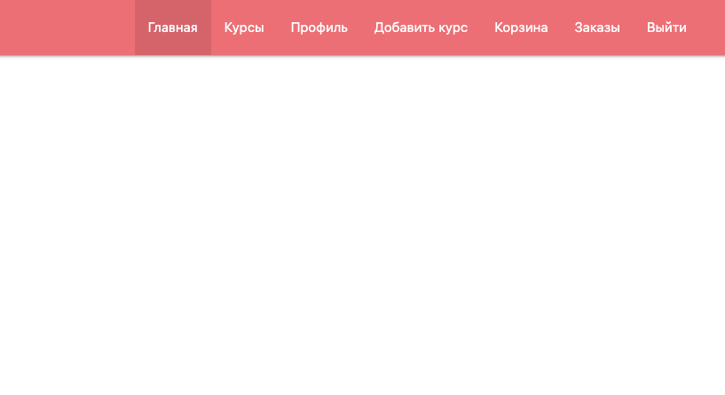
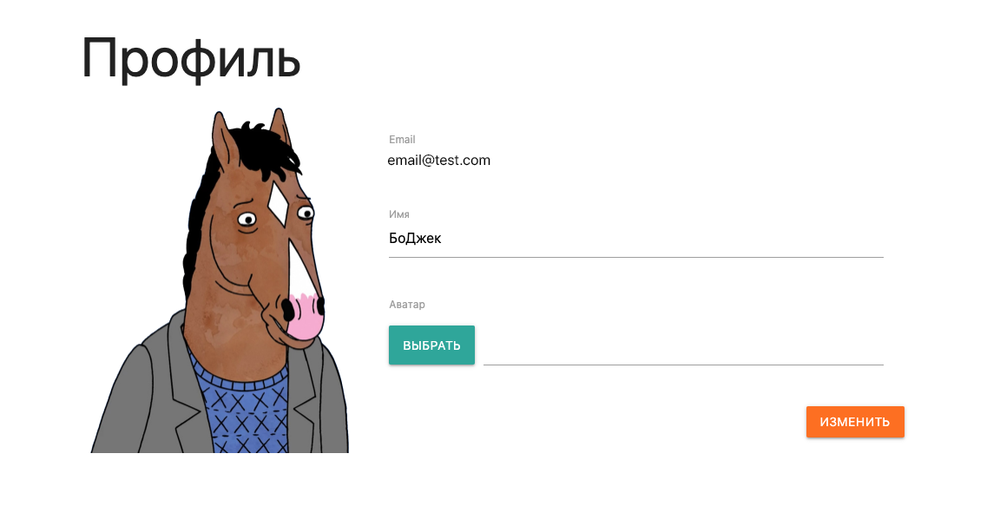
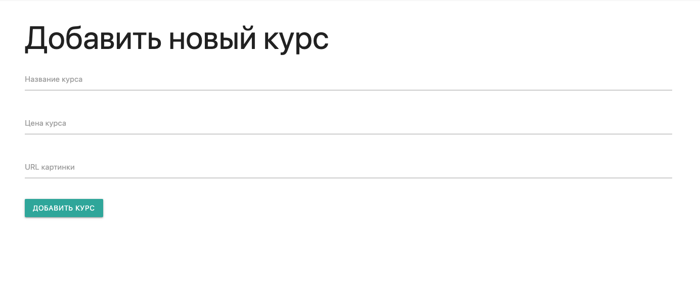
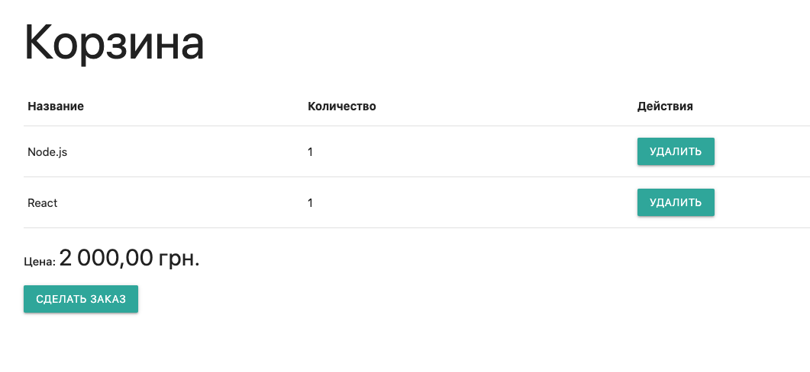

This is a full-fledged application built on technology MEVN.

The application is based on the idea of an online store for selling, for example, online courses. In fact, it could be anything.

Since the application is based on a Node.js, the main task was to develop a system of routing and access rights. Therefore, the functionality involves the registration and authorization of users. All information is stored in the MongoDB, passwords are encrypted using cryptographic algorithms.

Verification of data is provided when entering fields. It is possible to recover a password.

After authorization, the user has access to sections for managing the account, orders and offers.

There is a profile page. You can add an avatar or change the username.

Each authorized user can post his own product on the store’s website for sale (in this case, courses).

In the user's basket forms an order. Manages the number of products. The script automatically calculates the total cost.

**Live site:** [Heroku Page](https://pacific-citadel-34381.herokuapp.com/)
