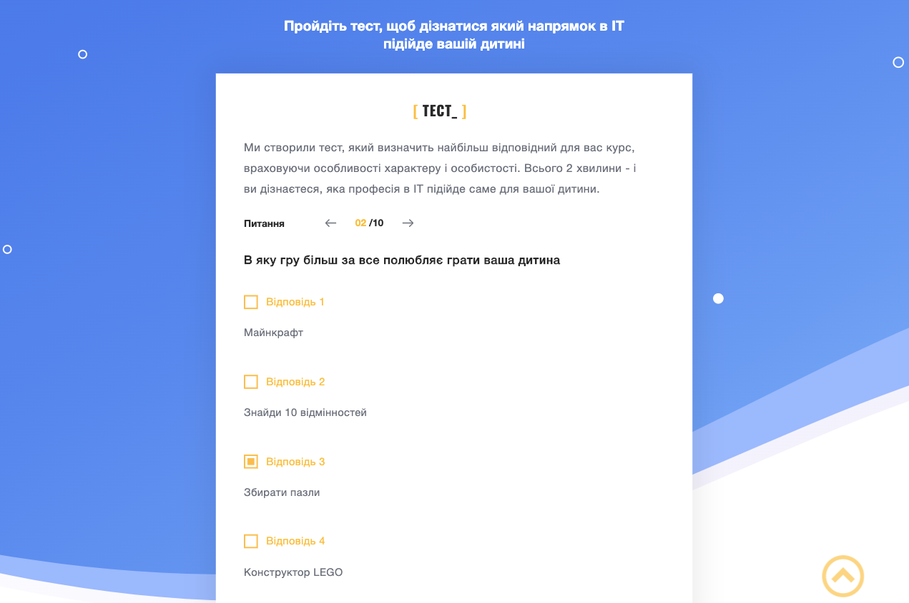
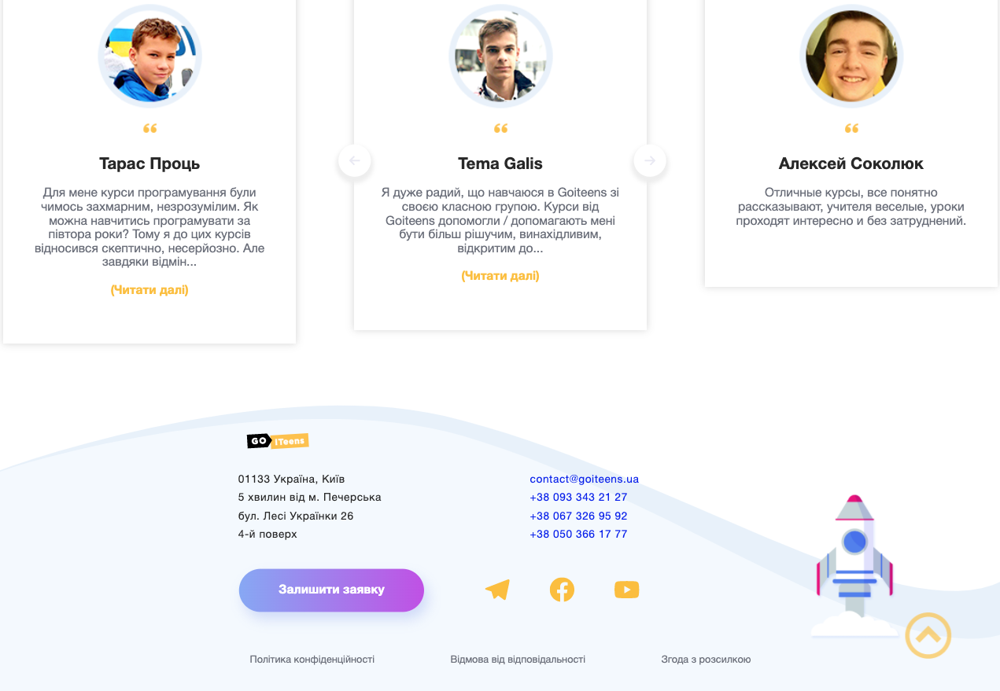

`Gulp`, `HTML5`, `CSS3`, `Sass(SCSS)`


Adaptive layout of a landing page for GoITeens children's educational IT school.


Base technologies: HTML5, CSS3. Ready to connect JS files. Scalable and compiled with Galp and Sass.



The page includes 11 sections. The site is cross-platform and adapted for mobile devices, tablets and desktops.



Sections of the page are includet as modules in the main site layout.

The code looked something like this:

```html
<body>
  <!-- Header -->
  //= ./html/header.html
  <!-- Sections -->
  <main>
    //= ./html/offer.html
    //= ./html/gm.html
    //= ./html/programs.html
    //= ./html/test.html
    //= ./html/skills.html
    //= ./html/format.html
    //= ./html/teachers.html
    //= ./html/certificate.html
    //= ./html/reviews.html
  </main>
  <!-- Footer -->
  //= ./html/footer.html

  <!-- inject:js -->
  <!-- endinject -->
</body>
```

**Live site:** [here](https://mort-gh.github.io/varya/build/)
