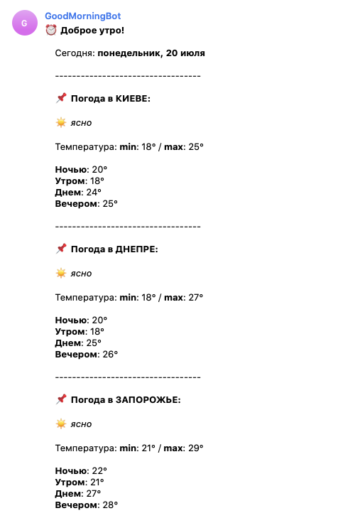

`Python`, `Telegram API`, `Docker`

I am using this bot for personal purposes. My friends and I have a group chat on Telegram, where we often discuss football matches.
The bot's task is to send a silent notification every morning, wishing good morning, the weather in each city where the chat participants live and the results of yesterday's football matches in the TOP leagues.

