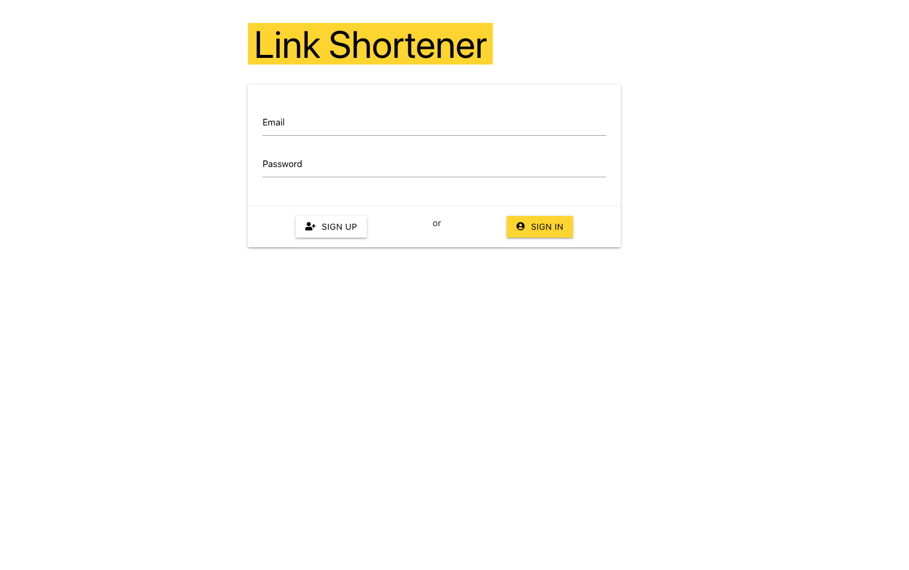
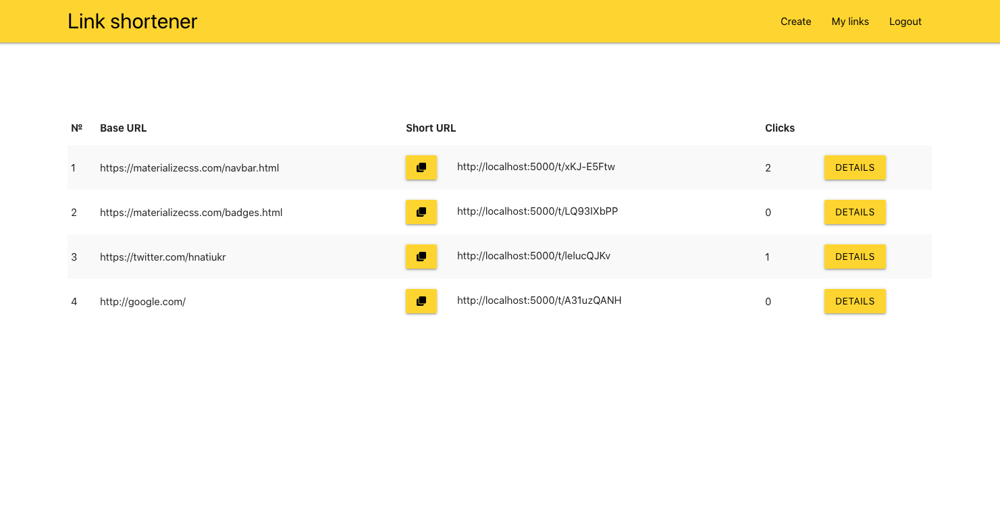
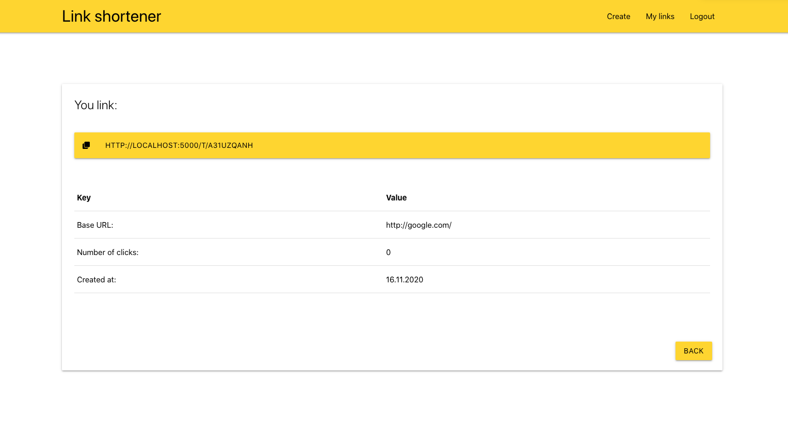

`Node.js`, `React`, `Express.js`, `MongoDB`, `JavaScript`, `Materialize.css`

**Link Shortener** - is a service that allows you to create shortened links, store them for future use.

Before using, the service offers to log in. Do not be alarmed, registration takes place in one click and does not require confirmation.

## Technologies and specifications 🧬

- frontend built on **React**
- backend built on **Node.js**
- database - **MongoDB**
- backend framework - **Express.js**
- navigation with **react-router-dom**
- app state control **react - hooks**
- app use **custom hooks**
- **Materializecss** as a style framework
- **JWT** for authentication

## Application features 🚀

- registration in one click ✅
- instant short link generation ✅
- storage of all shortened links ✅
- analytics of transitions on generated links ✅
- toaster notifications ✅

[GitHub](https://github.com/mort-gh/link-shortener-mern)