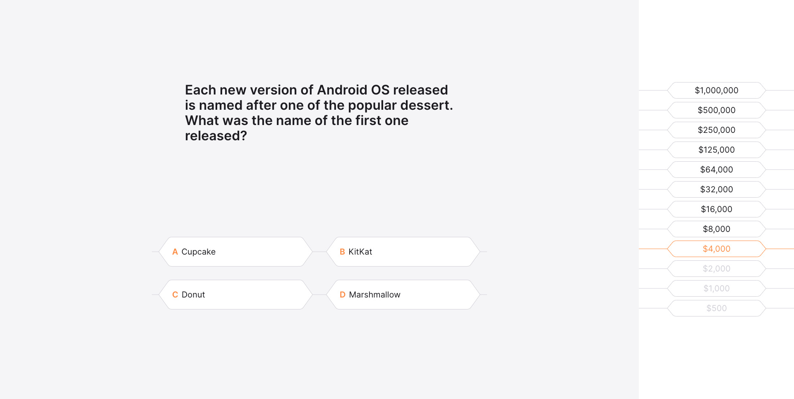

 `JavaScript`, `React.js`, `Redux/Redux-Thunk`, `SASS/SCSS`

**(WWBM) Who want to be a millionaire** - this app is a quiz game based on the famous game "Who Wants to Be a Millionaire?" The player is given 12 questions and 4 answers to each of them. To win the game, you need to answer all the questions correctly.

I made up the questions myself. I hope you find them interesting. Please don't judge me harshly 🤷‍♂️ 

## Technologies and specifications 🧬

- built on **React.js**
- navigation with **react-router-dom**
- app state control **Redux**, Redux - Thunk
- **scss/sass** style preprocessor
- **adaptive design** for mobile, tablet and desktop screens
- typing data inside components with **PropTypes**
- optimised memory and application loading with **React Suspense**
- code standardisation using **eslint (airbnb)**
- prevent bad commit/push with **Husky**
- uniform code style using **Prettier** configuration

## Application features 🚀

- random order of answer options each time a question is loaded ✅
- blocking option buttons after selecting until the next question is loaded ✅
- the ability to add several correct answers ✅
- the ability to change the order of questions ✅
- the ability to change the order of answer options ✅

[Live demo](https://affectionate-sammet-b40bc3.netlify.app/)

[GitHub](https://github.com/mort-gh/wwbm-genesis)