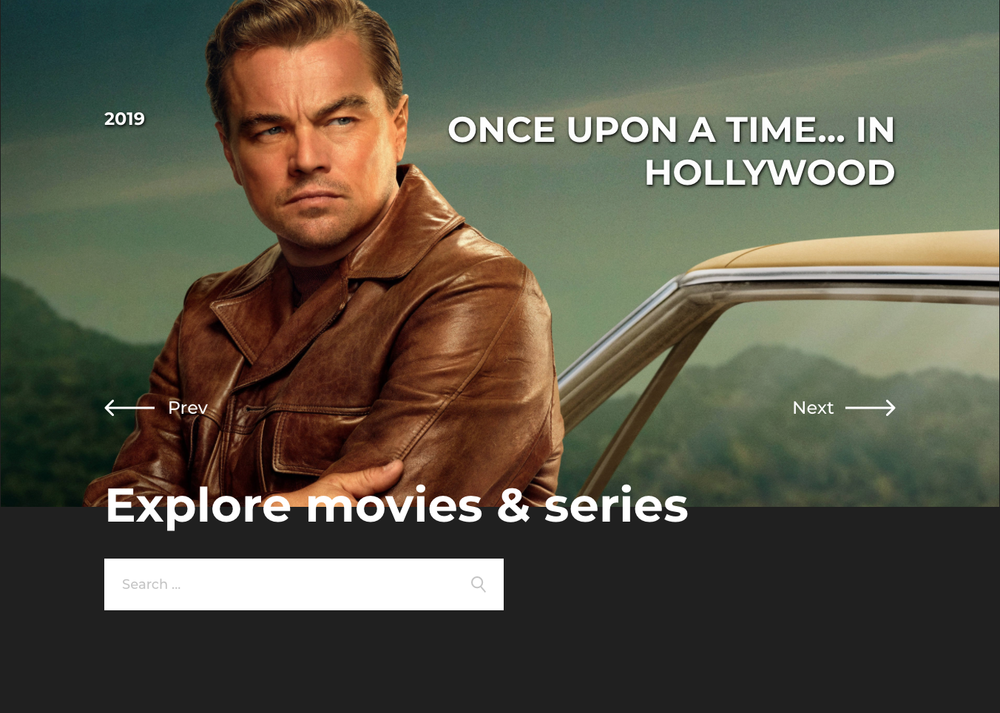
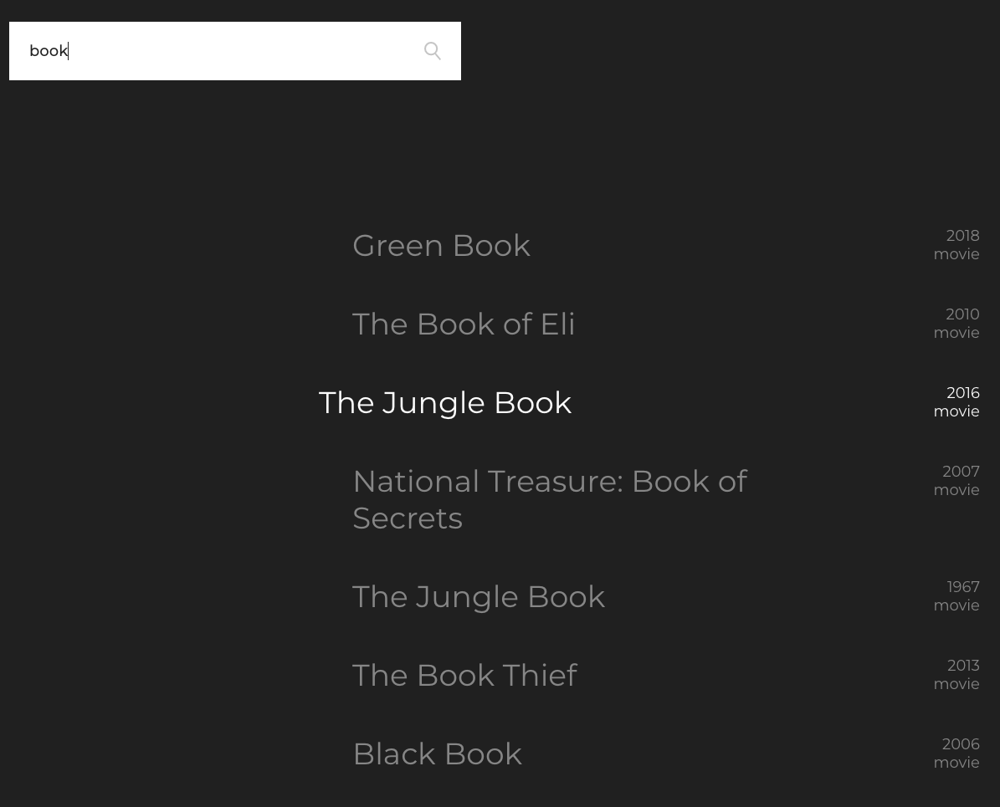
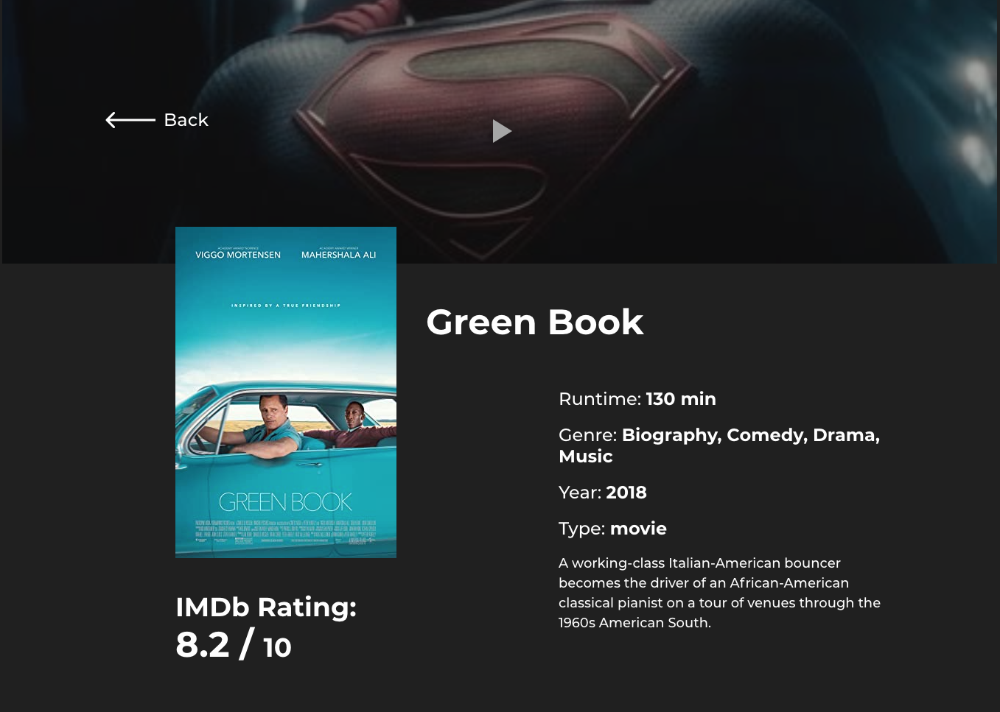

 `JavaScript`, `React.js`, `Redux/Redux-Thunk`, `SASS/SCSS`

**React Movie Database** - this is an application built on the basis of the OMDb API, for searching information about movies and serials.

## Technologies and specifications 🧬

- built on **React.js**
- navigation with **react-router-dom**
- app state control **Redux**, Redux - Thunk
- **scss/sass** style preprocessor
- **responsive design** for mobile and desktop devices
- typing data inside components with **PropTypes**

## Application features 🚀

- **search for movies by title or match in title**
- **live search**
- **detailed information about the selected movie**
- **convenient pagination of search results**
- **customisable slider**
- **ready for loading trailers**

[Live demo](https://keen-colden-df1815.netlify.app/)

[GitHub Page](https://github.com/mort-gh/rmdb-geeksforless)