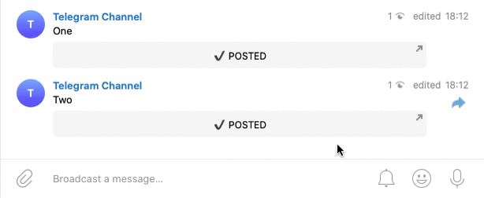

`Python`, `Telegram API`, `Docker`

Imagine you have two channels. First - you use to post any messages. In the second you want to publish only the most interesting posts. In the first chat, a like button is attached to determine the interest of messages among subscribers. All "selected" messages will be automatically published in the second chat in turn.

In the main channel, a Like 👍 button with a counter will be attached to each published message. If the number of likes is equal to COUNT value or more than half the number of subscribers, the message becomes popular and gets queued for publication in another chat. Popular posts are published no more than once per time in QUEUE_INTERVAL. Using the bot, you can track which messages most popular in the community to repost them into another chat.

_This is a private repository. Live demonstration only._
